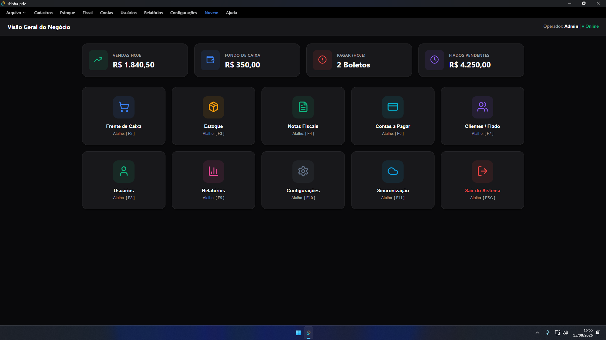
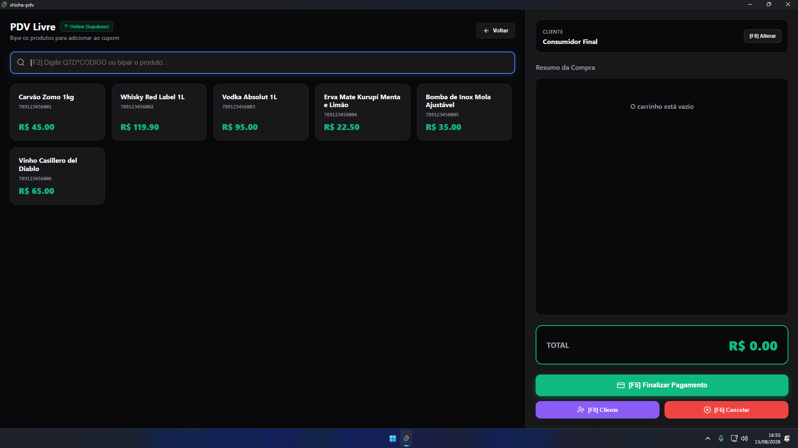
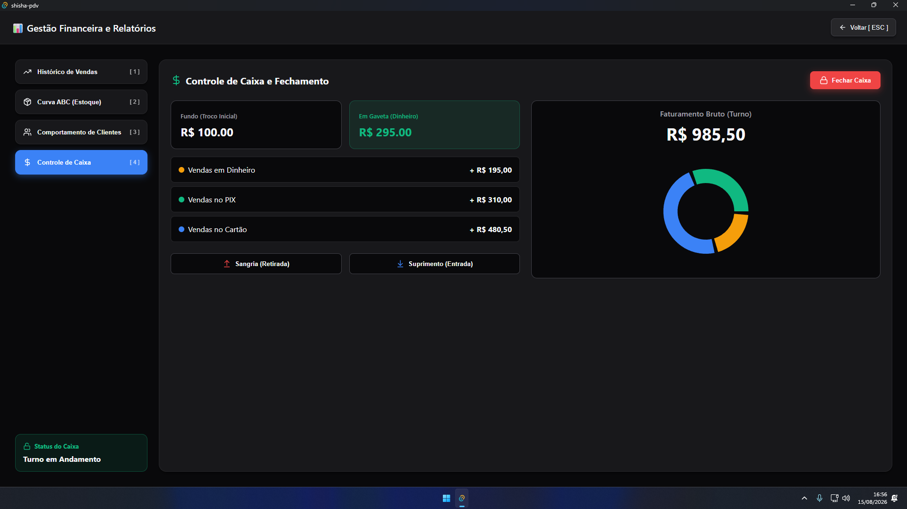

# Shisha Conveniência — Sistema PDV

Sistema de **Frente de Caixa (PDV)** e **Retaguarda** desktop, desenvolvido para lojas de conveniência, com foco em alta performance, estabilidade e uma interface moderna. Roda nativamente em **Windows** e **macOS**, priorizando agilidade no atendimento e facilidade de manutenção.


---

## 📋 Sumário

- [Visão Geral](#-visão-geral)
- [Pilares Tecnológicos](#-pilares-tecnológicos)
- [Funcionalidades](#-funcionalidades)
- [Capturas de Tela](#-capturas-de-tela)
- [Arquitetura do Projeto](#-arquitetura-do-projeto)
- [Requisitos](#-requisitos)
- [Instalação e Desenvolvimento](#-instalação-e-desenvolvimento)
- [Variáveis de Ambiente](#-variáveis-de-ambiente)
- [Build de Produção](#-build-de-produção)
  - [Windows](#windows)
  - [macOS (Universal)](#macos-universal)
- [Configuração do Tauri](#-configuração-do-tauri)
- [Roadmap](#-roadmap)
- [Contribuindo](#-contribuindo)
- [Licença](#-licença)
- [Autor](#-autor)

---

## 🎯 Visão Geral

O **Shisha Conveniência** é um sistema de PDV completo, projetado para operar em ambiente desktop nativo com arquitetura **offline-first**: o sistema é preparado para funcionar sem interrupções mesmo sem conexão à internet, com sincronização em segundo plano quando a conectividade retorna.

O projeto está na fase de **MVP (Produto Mínimo Viável)**, com a interface, estrutura de código e build multiplataforma já validadas, pronto para avançar para a camada de persistência de dados (Supabase + SQLite local).

## 🏗️ Pilares Tecnológicos

| Camada | Tecnologia |
|---|---|
| **Core / UI** | React.js + TypeScript |
| **Runtime / Empacotamento** | [Tauri v2](https://tauri.app/) — executável nativo leve e seguro |
| **Gerenciamento de Estado** | Context API (Tema e Configurações globais) |
| **Arquitetura** | Componentes modulares, offline-first |
| **Plataformas alvo** | Windows (x64) e macOS (Universal — Apple Silicon + Intel) |

## ✨ Funcionalidades

O sistema é dividido em **7 módulos principais**, todos com suporte a atalhos de teclado (**F-keys**) para otimizar a velocidade do operador no caixa.

### 🔐 Autenticação
- Tela de login segura para controle de acesso ao sistema.

### 🛒 Frente de Caixa (PDV)
- Busca rápida de produtos por nome ou código de barras.
- Suporte a multiplicador de quantidade (ex: `10*CODIGO`).
- Gestão de clientes (Consumidor Final ou Cliente Identificado).
- Múltiplas formas de pagamento (Dinheiro, PIX, Cartão).
- Cálculo automático de troco e fechamento de cupom.

### 📦 Estoque
- Listagem completa de produtos, categorias e preços.

### 🧾 Fiscal
- Módulo para emissão de NFC-e (integração com **FocusNFe** em implementação).

### 📊 Relatórios
Central analítica com quatro visões principais:
- **Histórico de Vendas** — detalhamento por data, cliente e meio de pagamento.
- **Curva ABC** — controle de estoque e capital imobilizado.
- **Comportamento de Clientes** — histórico de consumo e débitos (Fiado).
- **Fechamento de Caixa** — conciliação de turno, com sangria e recebimentos.

### ⚙️ Configurações
- Painel de customização com troca dinâmica de tema (**Modo Escuro / Madrugada** vs. **Modo Claro**).

## 🖼️ Capturas de Tela

<p align="center">
  
  <br/><em>Dashboard</em>
</p>

<p align="center">
  
  <br/><em>Frente de Caixa (PDV)</em>
</p>

<p align="center">
  
  <br/><em>Central de Relatórios</em>
</p>

## 🗂️ Arquitetura do Projeto

O código passou por uma refatoração profunda, saindo de um arquivo único para uma estrutura de pastas profissional e escalável:

```
shisha-pdv/
├── src/
│   ├── components/     # Componentes de UI reutilizáveis
│   ├── pages/          # Telas/rotas da aplicação
│   ├── contexts/        # Context API (ThemeContext, etc.)
│   ├── mocks/           # Dados mockados (fase pré-persistência)
│   ├── types/           # Tipagens TypeScript
│   └── ...
├── src-tauri/
│   ├── src/             # Código Rust (backend nativo)
│   ├── icons/           # Ícones do aplicativo
│   ├── Cargo.toml        # Dependências e config do Rust
│   └── tauri.conf.json  # Configuração do Tauri (bundle, janelas, etc.)
├── package.json
└── README.md
```

### Destaques da refatoração

- **Modularização**: separação clara entre `components/`, `pages/`, `contexts/`, `mocks/` e `types/`.
- **Context API**: `ThemeContext` centraliza o gerenciamento da aparência do sistema.
- **Cross-Platform Build**: geração de binários universais para Apple Silicon (M-series) e Intel (x86_64).
- **Build otimizado**: subsistema gráfico nativo configurado, eliminando janelas de terminal (CMD) e garantindo execução limpa em macOS e Windows.

## 🔧 Requisitos

Antes de começar, tenha instalado:

- [Node.js](https://nodejs.org/) (LTS recomendado)
- [Yarn](https://yarnpkg.com/)
- [Rust](https://www.rust-lang.org/tools/install) (via `rustup`)
- Dependências nativas do Tauri para o seu sistema operacional — siga o [guia oficial de pré-requisitos](https://tauri.app/start/prerequisites/)

### Para build no macOS (binário universal)

É necessário instalar os dois targets do Rust:

```bash
rustup target add aarch64-apple-darwin
rustup target add x86_64-apple-darwin
```

## 🚀 Instalação e Desenvolvimento

Clone o repositório e instale as dependências:

```bash
git clone https://github.com/TiagoAbudi/shisha-pdv.git
cd shisha-pdv
yarn install
```

Para rodar em modo de desenvolvimento (hot-reload, com a janela nativa do Tauri):

```bash
yarn tauri dev
```

> ℹ️ **Nota:** o projeto está na fase de MVP e atualmente consome dados mockados (`src/mocks/`). A camada de persistência real (Supabase + SQLite local) ainda está em desenvolvimento — veja o [Roadmap](#-roadmap).

## 🔑 Variáveis de Ambiente

Ao integrar o Supabase, crie um arquivo `.env` na raiz do projeto com as seguintes chaves:

```env
VITE_SUPABASE_URL=sua_url_do_projeto_supabase
VITE_SUPABASE_ANON_KEY=sua_chave_anon_publica
```

> ⚠️ Nunca commite o arquivo `.env` — adicione-o ao `.gitignore` e disponibilize um `.env.example` sem valores sensíveis para orientar outros desenvolvedores.

## 📦 Build de Produção

### Windows

Gera o instalador nativo (`.exe` / `.msi`) para Windows x64:

```bash
yarn tauri build
```

O executável e os instaladores são gerados em:

```
src-tauri/target/release/bundle/
```

### macOS (Universal)

Gera um binário universal compatível tanto com **Apple Silicon** (M1/M2/M3/M4) quanto com **Intel (x86_64)**:

```bash
yarn tauri build --target universal-apple-darwin
```

O `.app` e o `.dmg` são gerados em:

```
src-tauri/target/universal-apple-darwin/release/bundle/
```

> 💡 O build universal exige que os targets `aarch64-apple-darwin` e `x86_64-apple-darwin` estejam instalados no Rust (veja [Requisitos](#-requisitos)).

## ⚙️ Configuração do Tauri

O comportamento do build (identificador do app, ícones, targets de bundle, janelas, permissões, etc.) é definido em `src-tauri/tauri.conf.json`, com dependências e metadados do binário nativo em `src-tauri/Cargo.toml`.

Pontos relevantes já configurados no projeto:

- **Subsistema gráfico nativo**: configurado para não abrir janela de terminal (CMD) ao executar o app em produção, garantindo uma experiência limpa tanto no Windows quanto no macOS.
- **Bundle targets**: `nsis`/`msi` para Windows e `app`/`dmg` para macOS.
- **Build universal no macOS**: habilitado via `--target universal-apple-darwin`, combinando os binários `aarch64-apple-darwin` e `x86_64-apple-darwin` em um único artefato.

> ⚠️ Ajuste `identifier`, `productName`, `version` e os ícones em `tauri.conf.json` conforme os dados oficiais de publicação do seu app antes de gerar builds de distribuição.

## 🗺️ Roadmap

Com a interface e a estrutura já validadas, os próximos passos do projeto são:

- [ ] **Integração com Supabase** — banco de dados em nuvem com sincronização em tempo real.
- [ ] **Banco local (SQLite)** — garantia de funcionamento 100% offline para o PDV.
- [ ] **Finalização da API FocusNFe** — automação completa da emissão de notas fiscais (NFC-e).
- [ ] **Sistema de Auto-Update** — atualizações automáticas via GitHub Releases.

## 🤝 Contribuindo

1. Faça um fork do projeto.
2. Crie uma branch para sua feature (`git checkout -b feature/nova-funcionalidade`).
3. Faça commit das suas alterações (`git commit -m 'Adiciona nova funcionalidade'`).
4. Faça push para a branch (`git push origin feature/nova-funcionalidade`).
5. Abra um Pull Request.

## 📄 Licença

Este projeto está licenciado sob a licença MIT — veja o arquivo [LICENSE](./LICENSE) para mais detalhes.

## 👤 Autor

Desenvolvido por [**Tiago Abudi**](https://github.com/TiagoAbudi).

---

<p align="center">Desenvolvido para transformar a gestão de lojas de conveniência.</p>